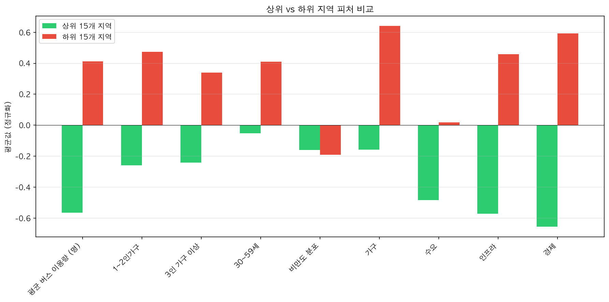
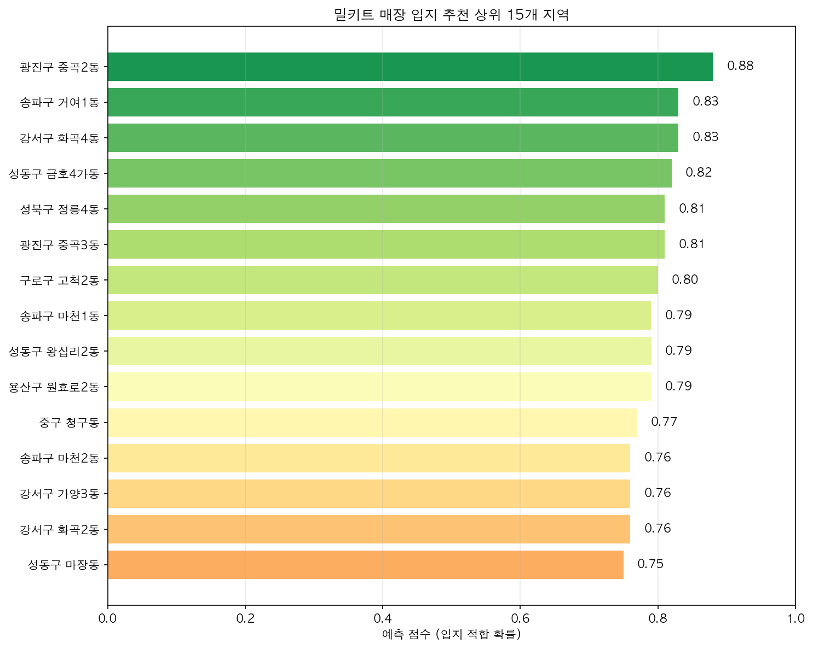

# 서울시 밀키트 매장 최적 입지 선정 프로젝트

서울시 공공데이터와 웹 크롤링을 활용하여 밀키트 매장의 최적 입지를 예측하는 머신러닝/딥러닝 프로젝트입니다.

## 프로젝트 개요

| 항목 | 내용 |
|------|------|
| **기간** | 2023.05.03 ~ 2023.05.24 (3주) |
| **인원** | 6명 |
| **목표** | 서울시 행정동별 밀키트 매장 입지 적합도 예측 |

## 기술 스택

| 분류 | 기술 |
|------|------|
| **데이터 수집** | Python, Selenium, Requests, 서울시 공공데이터 API |
| **데이터 분석** | Pandas, NumPy, GeoPandas |
| **시각화** | Matplotlib, Seaborn |
| **모델링** | Scikit-learn, TensorFlow/Keras |
| **기법** | PCA, Logistic Regression, SVC, KNN, Random Forest, Deep Learning |

---

## 주요 결과

### 모델 성능 비교 (분류: 입지 적합/부적합)

| 모델 | Accuracy | Precision | Recall | F1 Score | CV (5-Fold) |
|------|----------|-----------|--------|----------|-------------|
| Logistic Regression | 0.595 | 0.714 | 0.476 | 0.571 | 0.470 |
| **SVC** | **0.622** | **0.667** | **0.667** | **0.667** | **0.530** |
| KNN (k=5) | 0.595 | 0.650 | 0.619 | 0.634 | 0.568 |
| Random Forest | 0.432 | 0.500 | 0.476 | 0.488 | 0.432 |
| Deep Learning | 0.541 | 0.625 | 0.476 | 0.541 | - |

> SVC 모델이 Test Accuracy 62.2%로 가장 우수한 성능

### 최종 피처 (PCA 적용 후 9개)

| 순위 | 피처 | 중요도 |
|------|------|--------|
| 1 | 인프라 | 0.188 |
| 2 | 3인 가구 이상 | 0.124 |
| 3 | 30~59세 인구 | 0.118 |
| 4 | 1~2인가구 | 0.109 |
| 5 | 비만도 분포 | 0.100 |
| 6 | 수요 | 0.099 |
| 7 | 평균 버스 이용량 | 0.093 |
| 8 | 경제 | 0.091 |
| 9 | 가구 | 0.077 |

### 상위 vs 하위 지역 특성 비교



| 피처 | 상위 15개 평균 | 하위 15개 평균 | 차이 |
|------|---------------|---------------|------|
| 인프라 | -0.571 | 0.458 | -1.030 |
| 경제 | -0.655 | 0.593 | -1.249 |
| 평균 버스 이용량 | -0.564 | 0.412 | -0.977 |
| 1~2인가구 | -0.258 | 0.473 | -0.731 |

- **상위 지역**: 인프라/경제/교통 지표가 낮은 주거 밀집 지역
- **하위 지역**: 인프라/경제 지표가 높은 상업 지역 (역설적 결과)

### 입지 추천 상위 15개 지역



| 순위 | 지역 | 예측 점수 |
|------|------|----------|
| 1 | 광진구 중곡2동 | 0.88 |
| 2 | 강서구 화곡4동 | 0.83 |
| 3 | 송파구 거여1동 | 0.83 |
| 4 | 성동구 금호4가동 | 0.82 |
| 5 | 광진구 중곡3동 | 0.81 |
| 6 | 성북구 정릉4동 | 0.81 |
| 7 | 구로구 고척2동 | 0.80 |
| 8 | 용산구 원효로2동 | 0.79 |
| 9 | 성동구 왕십리2동 | 0.79 |
| 10 | 송파구 마천1동 | 0.79 |

**공통 특성**: 주거 밀집 지역, 중산층 가구 비율 높음, 대형 상업시설 적음

---

## 프로젝트 구조

```
seoul_mealkit_location_analysis/
├── src/                          # Python 모듈
│   ├── crawler.py                # 네이버 지도 리뷰 크롤러 (Selenium)
│   ├── data_loader.py            # 데이터 로딩 유틸리티
│   ├── preprocessing.py          # 데이터 전처리
│   ├── features.py               # 피처 엔지니어링
│   ├── models.py                 # ML/DL 모델
│   └── visualization.py          # 결과 시각화
├── notebooks/                    # Jupyter 노트북
│   ├── 01_eda.ipynb              # 탐색적 데이터 분석
│   ├── 02_modeling.ipynb         # 모델 학습 및 평가
│   └── 03_results.ipynb          # 결과 분석 및 시각화
├── data/
│   ├── raw/                      # 원본 데이터 (12개)
│   └── processed/                # 전처리된 데이터 (4개)
├── outputs/
│   ├── figures/                  # 시각화 결과물
│   └── models/                   # 학습된 모델 파일
├── docs/                         # 기획안 및 발표자료
├── requirements.txt
└── README.md
```

## 데이터 소스

### 공공데이터 (서울 열린데이터광장)
- 행정동별 인구통계 (성별, 연령별)
- 세대 유형 (1인가구, 맞벌이 등)
- 사업체 및 종사자 현황
- 공시지가, 유동인구

### 웹 크롤링
- 기존 밀키트 매장 위치 및 리뷰 데이터

## 분석 파이프라인

```
1. 데이터 수집
   ├── 서울시 공공데이터 API 호출 (인구, 교통, 사업체 등)
   └── Selenium으로 네이버 지도 크롤링
       └── 매장별 리뷰어 ID, 방문횟수 추출

2. 타겟 변수 생성
   └── 1인당 평균 방문수 = 총 방문횟수 / 리뷰어 ID 수
       (리뷰 작성 = 방문으로 간주, 재방문 고객이 많을수록 높은 값)

3. 전처리 및 피처 엔지니어링
   ├── 행정동 단위로 데이터 통합
   ├── 결측치 처리 (평균/중앙값 대체)
   └── 파생 변수 생성 (타겟 연령대, 소형 가구 등)

4. 차원 축소
   └── PCA (Standard Scaling 적용, 9개 주성분으로 압축)

5. 모델링
   ├── Logistic Regression, KNN, Random Forest, Deep Learning
   └── SVC (채택, Accuracy: 62.2%)

6. 결과 시각화
   └── 행정동별 입지 적합도 순위
```

## 실행 방법

```bash
# 1. 의존성 설치
pip install -r requirements.txt

# 2. 노트북 순서대로 실행
# notebooks/01_eda.ipynb → 02_modeling.ipynb → 03_results.ipynb
```

---

## 한계점

### 1. 데이터 관련
| 한계 | 설명 |
|------|------|
| **타겟 변수의 한계** | 실제 매출 데이터를 구할 수 없어, 리뷰 데이터를 크롤링하여 **"1인당 평균 방문수"**(= 총 방문횟수 / 리뷰어 ID 수)를 파생변수로 생성해 프록시로 사용 |
| **표본 크기 부족** | 서울시 내 밀키트 매장 수가 적어 과적합 위험 존재 |
| **시점 한계** | 2023년 5월 기준 데이터로, 현재 상권 변화 미반영 |

### 2. 모델 관련
| 한계 | 설명 |
|------|------|
| **일반화 어려움** | 밀키트 매장에 특화된 피처 설계로, 다른 업종에 바로 적용 불가 |
| **외부 변수 미반영** | 경쟁사 위치, 임대료 변동, 계절성 등 중요 변수 누락 |

---

## 서비스 구축을 위해 필요한 것들

### Phase 1: 데이터 인프라 구축
- [ ] **실시간 데이터 파이프라인**: 공공데이터 API 스케줄링 (Airflow, Prefect)
- [ ] **데이터 웨어하우스**: 수집 데이터 저장 및 관리 (PostgreSQL, BigQuery)
- [ ] **데이터 품질 모니터링**: 결측치, 이상치 자동 탐지

### Phase 2: 핵심 데이터 확보
- [ ] **매출 데이터 파트너십**: POS 업체, 배달앱과 협업하여 실제 매출 데이터 확보
- [ ] **경쟁사 데이터**: 주변 경쟁 매장 위치 및 밀도 분석
- [ ] **부동산 데이터**: 임대료, 권리금 등 비용 데이터 연동

### Phase 3: 모델 고도화
- [ ] **시계열 분석**: 상권 트렌드 예측 (계절성, 성장/쇠퇴 패턴)
- [ ] **앙상블 모델**: 여러 모델 조합으로 예측 안정성 향상
- [ ] **설명 가능한 AI**: SHAP, LIME으로 예측 근거 제공

### Phase 4: 서비스화
- [ ] **REST API 개발**: FastAPI로 예측 서비스 제공
- [ ] **웹 대시보드**: Streamlit/Dash로 시각화 대시보드 구축
- [ ] **업종 확장**: 카페, 편의점, 음식점 등 다양한 업종 지원

---

## 배운 점

### 1. 데이터 분석 관점
> **"데이터가 없으면 프록시를 찾아라, 하지만 한계를 명확히 인식하라"**

실제 매출 데이터가 없어서 방문 수를 대리 변수로 사용했습니다. **완벽한 데이터가 없을 때 어떻게 의미 있는 분석을 할 수 있는지** 고민하게 되었고, 프록시 변수의 한계를 명확히 인식하는 것이 중요하다는 걸 배웠습니다.

### 2. 피처 엔지니어링 관점
> **"도메인 지식이 모델 성능을 좌우한다"**

단순히 모든 변수를 넣는 것보다, **밀키트 소비자 특성**(1인가구, 맞벌이, 30~50대)을 이해하고 관련 피처를 설계했을 때 모델 성능이 크게 향상되었습니다.

### 3. 프로젝트 관점
> **"작은 데이터로도 프레임워크는 만들 수 있다"**

데이터가 부족해서 예측 정확도는 한계가 있었지만, **전체 ML 파이프라인**을 경험했습니다. 이 프레임워크는 데이터만 확보되면 다른 프로젝트에도 재활용할 수 있습니다.

### 4. 협업 관점
> **"인터페이스를 먼저 정의하라"**

6명이 병렬로 작업하면서 **데이터 포맷, 컬럼명을 미리 정의**하는 것의 중요성을 배웠습니다. 중간에 포맷이 바뀌면서 재작업이 발생한 경험이 이후 프로젝트에서 초기 설계를 더 신중하게 하는 계기가 되었습니다.

---

## 기여도

| 역할 | 기여도 |
|------|--------|
| 데이터 수집 및 전처리 | 50% |
| 피처 엔지니어링 | 50% |
| ML/DL 모델링 | 50% |

## 라이선스

이 프로젝트는 학습 목적으로 제작되었습니다.
